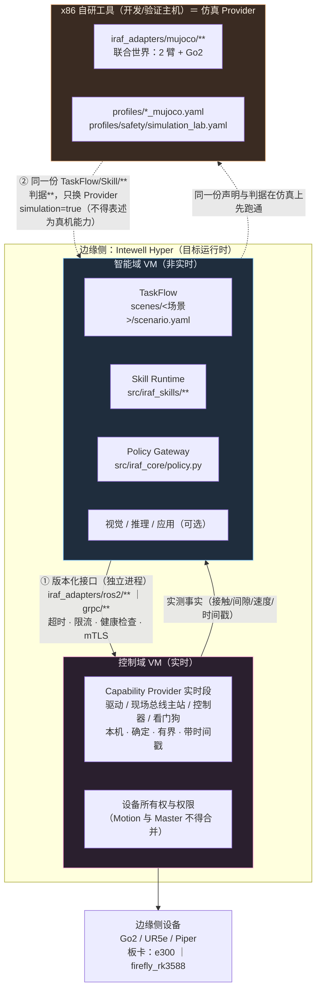
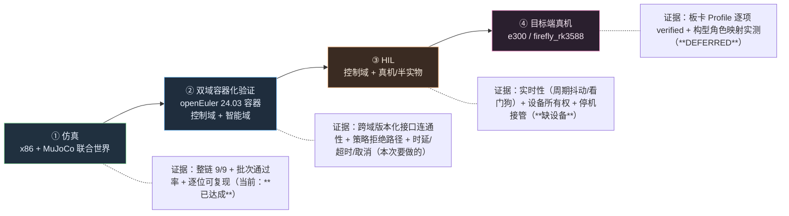

# 部署拓扑与域分工（控制域 / 智能域 / x86 仿真工具）

> 依据：AGENTS.md 铁律 1.4（网络不得进实时闭环）、2.11（跨发行版 Provider 独立进程 + 版本化接口）、
> 6.7（Ubuntu 22.04/Humble 为认证基线）、6.10/6.11（Hyper 构型与"合并不合边界"）、3.2（未知值写 `unverified`）
> 数据来源：`profiles/boards/*.yaml`、`profiles/safety/*.yaml`、`src/iraf_adapters/*/`（**本文件不硬编码构型数字**）

---

## 1. 拓扑图（三块 + 两条边界）



**两条边界上允许什么、禁止什么**
| 边界 | 允许 | 禁止（铁律） |
|---|---|---|
| ① 智能域 ↔ 控制域 | 版本化 gRPC / ROS 2 Action；独立进程；有 deadline、取消、健康检查、限流、最小权限 | **HTTP / 网络推理 / AgentOS 不得进入 L0/L1 闭环**（1.4）；禁止把 C++ `.so` 当跨平台插件 ABI（2.11） |
| ② 仿真 ↔ 框架 | 复用同一份 `scenes/**`、`src/iraf_skills/**`、判据与批次；只替换 Provider 与 Profile | 仿真结论不得表述为真机能力；必须 `simulation=true`；板卡证据不得用 dry-run/mock 冒充（3.2 / 6.7） |

---

## 2. IRAF 分层 ↔ 域 ↔ 声明来源

| IRAF 层 | 落在哪个域 | 声明/配置来源 | 证据形态 | 不得做什么 |
|---|---|---|---|---|
| TaskFlow（步骤编排） | 智能域 | `scenes/<场景>/scenario.yaml`（action/params/criteria） | 每步 status + measured + 判词 | 不得把判据写进实现 |
| Skill Runtime（技能执行） | 智能域 | `src/iraf_skills/**` + `skills/<name>/*.input.json` | skill evidence | 不得直发驱动命令 |
| Policy Gateway（策略/放行） | 智能域 | `profiles/safety/*.yaml`（字段：`verification / simulation_only / default / allowed_skills / max_duration_ms`） | `PolicyDecision(rules=rbac,schema,profile,safety,capability,precondition)` | 未验证配置只能用于仿真；拒绝要显式 |
| Capability Provider（能力实现） | **控制域**（真机）/ x86（仿真） | `config/<机型>_*.yaml`、`profiles/<机型>_mujoco.yaml` | 实测 qpos/接触/力/时间戳 | 不得被上层旁路 |
| 机型/板卡/Hyper 声明 | 声明面（跨域共享） | `profiles/boards/*.yaml`、签名 HyperProfile/Release manifest | `status` 与逐项取值（未知写 `unverified`） | 构型数字**不得硬编码**（6.10） |

---

## 3. 三个正式构型（数据取自 BoardProfile；角色映射**待签名 HyperProfile 回填**）

| BoardProfile | 覆盖构型（`metadata.hyper_models`） | 架构 | 当前 `status` | adapters（`spec.adapters`） | VM 数量/编号/IP/OS/角色映射 |
|---|---|---|---|---|---|
| `profiles/boards/e300.yaml` | `MQ50-E300-3VM-LPR`、`MQ50-E300-3VM-LPP` | aarch64 | `unverified` | `agentos_bridge / npu / master` 均 `unverified` | **待回填**（只从签名 HyperProfile/Release manifest 读取） |
| `profiles/boards/firefly_rk3588.yaml` | `FIREFLY-RK3588-2VM-LR` | aarch64 | `unverified` | 同上 | **待回填** |

> `target.{os,kernel,python_tag,platform_tag,glibc_min}` 目前全为 `unverified`（板卡不在场）⇒ **不得**凭推测填写。
> 回填脚本应**读 manifest 生成**，不得在业务代码/文档里抄数字（AGENTS 5.3）。

---

## 4. "合并不合边界"（铁律 6.11）在声明与目录上的落法

```
2VM 构型（FIREFLY-RK3588-2VM-LR）合并部署角色时：
  · Motion（控制域）与 Master（智能域）仍是**独立进程**、独立权限、独立资源限额、独立设备所有权
  · 合并只发生在"部署编排"层（谁在哪个 VM 起），不发生在"安全边界"层
  · 声明落点：BoardProfile 的 spec.adapters.*（逐项 unverified→verified）+ HyperProfile 的角色映射
  · 代码落点：src/iraf_adapters/{ros2,grpc}/** 作为跨域接口；Provider 进程不得共用同一设备句柄
```

---

## 5. 验收阶梯（每一级都要自己的证据，不得跨级顶替）



---

## 6. 双域容器化验证（本次任务）与它的**固有局限**

**映射**：控制域容器 = Provider 实时段的**替身**（在本机跑，用桩/回环实现能力）；智能域容器 = TaskFlow + Skill Runtime + Policy Gateway；x86 主机 = MuJoCo 仿真 Provider。

**必须声明的局限（写进报告 `notes`，不得含糊）**
```
· 容器共享同一内核与本机时钟 ⇒ **不能**证明实时性（周期抖动/看门狗/确定性），那只属于 ③ HIL / ④ 真机
· 两个容器间用版本化接口（gRPC/ROS2）连通 ⇒ 能证明"跨域接口契约 + 策略拒绝 + 超时/取消"这几件事
· 容器不是板卡 ⇒ 不得作为 e300/firefly 的 `unverified → verified` 证据
· 若在 x86 上跑 aarch64 rootfs（qemu-user-static）⇒ 仅证明"文件系统/依赖装得上"，**不得**当性能证据
```

**复现入口（受控、可回滚）**
```bash
# 0) 前置：镜像已在本机（rootfs_openeuler_24.03-lts-sp1_{aarch64,loongarch64}）；跨架构需 qemu
docker run --privileged --rm multiarch/qemu-user-static --reset -p yes      # 注册 binfmt（一次即可）
# 1) 起两个域容器（命名体现角色，端口体现跨域接口）
docker run -d --name iraf-control-domain  <openEuler24.03镜像> sleep infinity
docker run -d --name iraf-intel-domain    <openEuler24.03镜像> sleep infinity
# 2) 两容器内各自装依赖并放 IRAF（只装运行所需，不装仿真依赖）
docker cp <repo>/src        iraf-intel-domain:/opt/iraf/src
docker cp <repo>/skills     iraf-intel-domain:/opt/iraf/skills
docker cp <repo>/scenes     iraf-intel-domain:/opt/iraf/scenes
docker cp <repo>/config     iraf-control-domain:/opt/iraf/config     # 控制域只要机型/板卡/安全声明
# 3) 验证（智能域发起 → 控制域返回实测事实 → 判据判定；含拒绝路径）
#    见 scripts/verify_domain_split.sh（**待实现**，见下 §6.1）
```

### 6.1 已验证的容器事实（2026-10-08 实测，照抄即可复现）
```bash
# 镜像：本机现成的 openEuler 24.03 LTS-SP1 rootfs（与真实板卡**同架构 aarch64**）
IMG=rootfs_openeuler_24.03-lts-sp1_aarch64:latest
docker run --privileged --rm multiarch/qemu-user-static --reset -p yes   # 注册 binfmt（x86 宿主机跑 aarch64 必需，一次即可）
docker run -d --name iraf-control-domain $IMG sleep infinity
docker run -d --name iraf-intel-domain   $IMG sleep infinity
```
容器内实测（两个都一致）：`uname -m = aarch64`｜`NAME="openEuler" VERSION="24.03 (LTS-SP1)"`｜`Python 3.11.6`｜`pip3`/`dnf` 可用
　　已装依赖（**均为 aarch64 轮子，未走编译**）：`pyyaml 6.0.3`、`grpcio 1.84.0`、`protobuf 7.36.2`
　　（`pip3 download --only-binary :all: grpcio` 成功 ⇒ 跨域接口可按铁律用**真 gRPC**，无需退化成桩传输）

### 6.2 跨域链路的当前缺口（S2 结论，实读代码）
```
契约      ✅ 已存在：api/proto/iraf/v1/{runtime,skill,events,common}.proto（iraf.v1 = 带版本；**复用，不新造**）
客户端    ✅ 已存在且较实：src/iraf_sdk/client.py（579 行；含 identity_of / deadline_after / canonical_execute_body
                        / execute_request_from_body / status_from_state / _grpc_module，HTTP + gRPC 双通道）
服务端    ⚠ **更正（同日）**：gRPC 服务端**已存在** —— `src/iraf_adapters/grpc/runtime_grpc.py` 的
              `SkillRuntimeServicer`：`Execute`→`stream SkillFeedback`、`Cancel`、`GetExecution`、token 鉴权、
              `add_execute_get_servicer_to_server` 注册入口；`server.py`（43 行）只是**入口桩**。原判"服务端缺失"作废。
注册表    ❌ 有界范围（grpc/ sdk/ core/）内 grep 未见 CapabilityProvider / register_provider / PROVIDERS
          ⇒ 真正缺口 = **服务端后面要接的 Provider（能力实现）与注册表**
⇒ 待实现两件 + 一条脚本：provider_stub.py（控制域替身：可复现事实 + 可注入"超时/不可达"两种故障）、
              把 `runtime` + provider 接进 `server.py`（用它现成的 `add_execute_get_servicer_to_server`）、
              scripts/verify_domain_split.sh（起链路 + 四例验证 + 报告）
⇒ 四例：①正常 ②策略拒绝 IRAF-POLICY-DENIED ③deadline 超时/取消 ⇒ 显式失败 ④Provider 不可达 ⇒ 显式失败 + 安全停机
```
**回滚**：`docker rm -f iraf-control-domain iraf-intel-domain`；宿主与仓库无副作用（只读挂载/拷贝）。

---

## 7. 与"严格 IRAF"的关系（自查口径）

| 检查项 | 现状 |
|---|---|
| 上层是否可能旁路 Provider | 需**逐条核对** `iraf_adapters/mujoco` 与 `iraf_skills/common` 是否都经 Policy Gateway（一条 grep 即可定论，见开发说明 §附录） |
| 跨域接口是否版本化、独立进程 | `src/iraf_adapters/{ros2,grpc}/**` 是唯一合法跨域通道；容器化验证要验证**超时/取消/健康检查**三项 |
| 声明是否唯一来源 | 已知债：站位 ↔ 抓取目标 ↔ 落点垫"同一事实多处"（见整理计划 A2） |
| 未验证是否显式 | BoardProfile 全 `unverified` ✓；报告 notes 必须写明"容器/仿真不构成板卡证据" |
