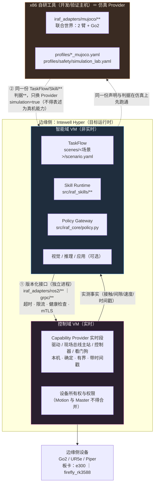
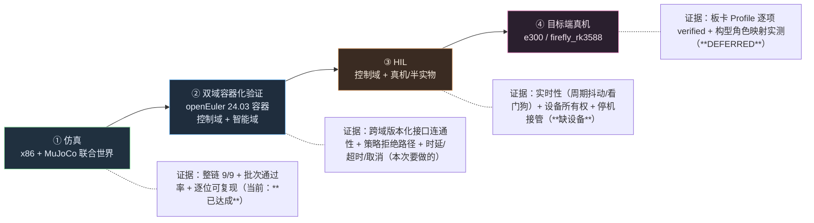

# 部署拓扑与域分工（控制域 / 智能域 / x86 仿真工具）

> 依据：AGENTS.md 铁律 1.4（网络不得进实时闭环）、2.11（跨发行版 Provider 独立进程 + 版本化接口）、
> 6.7（Ubuntu 22.04/Humble 为认证基线）、6.10/6.11（Hyper 构型与"合并不合边界"）、3.2（未知值写 `unverified`）
> 数据来源：`profiles/boards/*.yaml`、`profiles/safety/*.yaml`、`src/iraf_adapters/*/`（**本文件不硬编码构型数字**）

---

## 1. 拓扑图（三块 + 两条边界）



**两条边界上允许什么、禁止什么**
| 边界 | 允许 | 禁止（铁律） |
|---|---|---|
| ① 智能域 ↔ 控制域 | 版本化 gRPC / ROS 2 Action；独立进程；有 deadline、取消、健康检查、限流、最小权限 | **HTTP / 网络推理 / AgentOS 不得进入 L0/L1 闭环**（1.4）；禁止把 C++ `.so` 当跨平台插件 ABI（2.11） |
| ② 仿真 ↔ 框架 | 复用同一份 `scenes/**`、`src/iraf_skills/**`、判据与批次；只替换 Provider 与 Profile | 仿真结论不得表述为真机能力；必须 `simulation=true`；板卡证据不得用 dry-run/mock 冒充（3.2 / 6.7） |

---

## 2. IRAF 分层 ↔ 域 ↔ 声明来源

| IRAF 层 | 落在哪个域 | 声明/配置来源 | 证据形态 | 不得做什么 |
|---|---|---|---|---|
| TaskFlow（步骤编排） | 智能域 | `scenes/<场景>/scenario.yaml`（action/params/criteria） | 每步 status + measured + 判词 | 不得把判据写进实现 |
| Skill Runtime（技能执行） | 智能域 | `src/iraf_skills/**` + `skills/<name>/*.input.json` | skill evidence | 不得直发驱动命令 |
| Policy Gateway（策略/放行） | 智能域 | `profiles/safety/*.yaml`（字段：`verification / simulation_only / default / allowed_skills / max_duration_ms`） | `PolicyDecision(rules=rbac,schema,profile,safety,capability,precondition)` | 未验证配置只能用于仿真；拒绝要显式 |
| Capability Provider（能力实现） | **控制域**（真机）/ x86（仿真） | `config/<机型>_*.yaml`、`profiles/<机型>_mujoco.yaml` | 实测 qpos/接触/力/时间戳 | 不得被上层旁路 |
| 机型/板卡/Hyper 声明 | 声明面（跨域共享） | `profiles/boards/*.yaml`、签名 HyperProfile/Release manifest | `status` 与逐项取值（未知写 `unverified`） | 构型数字**不得硬编码**（6.10） |

---

## 3. 三个正式构型（数据取自 BoardProfile；角色映射**待签名 HyperProfile 回填**）

| BoardProfile | 覆盖构型（`metadata.hyper_models`） | 架构 | 当前 `status` | adapters（`spec.adapters`） | VM 数量/编号/IP/OS/角色映射 |
|---|---|---|---|---|---|
| `profiles/boards/e300.yaml` | `MQ50-E300-3VM-LPR`、`MQ50-E300-3VM-LPP` | aarch64 | `unverified` | `agentos_bridge / npu / master` 均 `unverified` | **待回填**（只从签名 HyperProfile/Release manifest 读取） |
| `profiles/boards/firefly_rk3588.yaml` | `FIREFLY-RK3588-2VM-LR` | aarch64 | `unverified` | 同上 | **待回填** |

> `target.{os,kernel,python_tag,platform_tag,glibc_min}` 目前全为 `unverified`（板卡不在场）⇒ **不得**凭推测填写。
> 回填脚本应**读 manifest 生成**，不得在业务代码/文档里抄数字（AGENTS 5.3）。

---

## 4. "合并不合边界"（铁律 6.11）在声明与目录上的落法

```
2VM 构型（FIREFLY-RK3588-2VM-LR）合并部署角色时：
  · Motion（控制域）与 Master（智能域）仍是**独立进程**、独立权限、独立资源限额、独立设备所有权
  · 合并只发生在"部署编排"层（谁在哪个 VM 起），不发生在"安全边界"层
  · 声明落点：BoardProfile 的 spec.adapters.*（逐项 unverified→verified）+ HyperProfile 的角色映射
  · 代码落点：src/iraf_adapters/{ros2,grpc}/** 作为跨域接口；Provider 进程不得共用同一设备句柄
```

---

## 5. 验收阶梯（每一级都要自己的证据，不得跨级顶替）



---

## 6. 双域容器化验证（本次任务）与它的**固有局限**

**映射**：控制域容器 = Provider 实时段的**替身**（在本机跑，用桩/回环实现能力）；智能域容器 = TaskFlow + Skill Runtime + Policy Gateway；x86 主机 = MuJoCo 仿真 Provider。

**必须声明的局限（写进报告 `notes`，不得含糊）**
```
· 容器共享同一内核与本机时钟 ⇒ **不能**证明实时性（周期抖动/看门狗/确定性），那只属于 ③ HIL / ④ 真机
· 两个容器间用版本化接口（gRPC/ROS2）连通 ⇒ 能证明"跨域接口契约 + 策略拒绝 + 超时/取消"这几件事
· 容器不是板卡 ⇒ 不得作为 e300/firefly 的 `unverified → verified` 证据
· 若在 x86 上跑 aarch64 rootfs（qemu-user-static）⇒ 仅证明"文件系统/依赖装得上"，**不得**当性能证据
· 智能域容器**共享控制域的网络命名空间**（`--network container:<控制域>`）：开发 gRPC 适配器
  （`server.py`）按安全设计**只允许绑定回环**，跨容器回环要通只能共享 netns。
  这是实验室捷径，**不构成网络隔离证据**；生产用 mTLS + 真实接口 + 独立 netns。
  ⚠ **禁止**为图方便去放开 `server.py` 那条绑定限制（那是安全边界，不是阻碍）。
· 控制域容器**不装仿真依赖**（mujoco 只在智能域/x86 侧）：这既是设计，也是本轮抓到的缺陷来源
```

**复现入口（受控、可回滚；已实现，不再是待办）**
```bash
# 0) 前置：镜像已在本机（rootfs_openeuler_24.03-lts-sp1_{aarch64,loongarch64}）；跨架构需 qemu
docker run --privileged --rm multiarch/qemu-user-static --reset -p yes      # 注册 binfmt（一次即可）
# 1) 一条命令跑完整条链路（起/复用两容器 → 同步 → 装依赖 → 生成 stub → 起服务端 → 四例 → 收证）
cd <repo>
IRAF_GRPC_TOKEN=<部署下发凭据> bash scripts/verify_domain_split.sh
#    证据落 build/acceptance/domain-split/{run.log,case-*.log,control-trace-*.jsonl,control-server-*.log}
#    可选：--no-sync（跳过代码同步）、--out <dir>、IRAF_RUN_ID=<id>（指定本轮账本目录名）
# 2) 只跑本机进程内预检（不起容器，秒级；用于改桩后快速回归）
PYTHONPATH=src python3 scripts/probe_domain_split_local.py     # 四例 15 项判据
PYTHONPATH=src python3 scripts/probe_domain_stub_contract.py   # 装配契约 + 拒绝路径 13 项
```

编排脚本自己做这几件事（细节见脚本头注释）：容器幂等起停、**服务端起停只按 PID 文件**
（不用 pgrep/pkill 匹配命令行）、每轮独立账本目录、控制域审计账回收（证"安全停机/故障注入
真的发生在控制域"）。

### 6.1 已验证的容器事实（2026-10-08 实测，照抄即可复现）
```bash
# 镜像：本机现成的 openEuler 24.03 LTS-SP1 rootfs（与真实板卡**同架构 aarch64**）
IMG=rootfs_openeuler_24.03-lts-sp1_aarch64:latest
docker run --privileged --rm multiarch/qemu-user-static --reset -p yes   # 注册 binfmt（x86 宿主机跑 aarch64 必需，一次即可）
docker run -d --name iraf-control-domain $IMG sleep infinity
docker run -d --name iraf-intel-domain   $IMG sleep infinity
```
容器内实测（两个都一致）：`uname -m = aarch64`｜`NAME="openEuler" VERSION="24.03 (LTS-SP1)"`｜`Python 3.11.6`｜`pip3`/`dnf` 可用
　　已装依赖（**均为 aarch64 轮子，未走编译**）：`pyyaml 6.0.3`、`grpcio 1.84.0`、`protobuf 7.36.2`
　　（`pip3 download --only-binary :all: grpcio` 成功 ⇒ 跨域接口可按铁律用**真 gRPC**，无需退化成桩传输）

### 6.2 跨域链路的当前缺口（S2 结论，实读代码）
```
契约      ✅ 已存在：api/proto/iraf/v1/{runtime,skill,events,common}.proto（iraf.v1 = 带版本；**复用，不新造**）
客户端    ✅ 已存在且较实：src/iraf_sdk/client.py（579 行；含 identity_of / deadline_after / canonical_execute_body
                        / execute_request_from_body / status_from_state / _grpc_module，HTTP + gRPC 双通道）
服务端    ⚠ **更正（同日）**：gRPC 服务端**已存在** —— `src/iraf_adapters/grpc/runtime_grpc.py` 的
              `SkillRuntimeServicer`：`Execute`→`stream SkillFeedback`、`Cancel`、`GetExecution`、token 鉴权、
              `add_execute_get_servicer_to_server` 注册入口；`server.py`（43 行）只是**入口桩**。原判"服务端缺失"作废。
注册表    ⚠ **再更正**：注册表**存在** —— `src/iraf_core/registry.py: SkillRegistry()`，由 `IRAF_SKILL_ROOT` 加载技能目录；
          先前"未命中"是因为我按 `CapabilityProvider/register_provider/PROVIDERS` 之名 grep（**措辞错了**）。
          Provider(backend) **不需要改代码**：`bootstrap.py:load_backend(IRAF_BACKEND_ENTRYPOINT, json.loads(IRAF_BACKEND_CONFIG), profile, authority)`
          ⇒ 控制域只需提供**一个外部桩模块**并把 entrypoint/config 用环境变量指过去。
⇒ 待做（**不必改 IRAF 框架代码**）：① 读 `load_backend` 的调用约定（桩可调用的入参与返回的 backend 接口）
        ② 写控制域 Provider 桩模块（可复现事实 + 可注入"超时/不可达"）
        ③ 两容器各设 6 个 IRAF_* 环境变量起 server / 跑 sdk 客户端，执行四例验证
        ⚠ 上一版此处写的"缺口=注册表/待改 bootstrap"**作废**
⇒ 待实现（2026-10-08 再更正：缺口已定位到**一根线**）：
   `src/iraf_adapters/grpc/server.py`（43 行）**已经把线接好**：`runtime = build_runtime_from_env()`
   → `add_execute_get_servicer_to_server(SkillRuntimeServicer(runtime, token, subject), server)`
   → `add_event_servicer_to_server(EventServicer(runtime.store, token, subject), server)`，
   且带一道 `runtime.profile.simulation` 守卫、`backend` 有 `start_continuous` 时挂 MuJoCo supervisor。
   `SkillRuntime.__init__(profile, safety_policy, backend, registry, authority, store, policy=None, resource_id=None, safety=None)`
   ⇒ **backend（Provider）是注入的**，运行时由 `iraf_adapters/bootstrap.py: build_runtime_from_env()` 构造。
   ⇒ 真缺口 = **bootstrap 能否按声明/环境构造"控制域 Provider 桩"的 backend**（当前只走 MuJoCo）。
   待做：① 读 `bootstrap.py` 定 backend 的选择方式（是否已有 registry/能力表——我先前 grep 未命中，很可能它就在这里）
        ② 加 `provider_stub` backend（可复现事实 + 可注入"超时/不可达"）
        ③ `scripts/verify_domain_split.sh` 起链路跑四例 ⇒ **已实现并通过**，见 §6.3（含证据路径与实测值）
⇒ 四例：①正常 ②策略拒绝 IRAF-POLICY-DENIED ③deadline 超时/取消 ⇒ 显式失败 ④Provider 不可达 ⇒ 显式失败 + 安全停机
```
### 6.3 四例跨域验收结果（2026-10-08 实测，`scripts/verify_domain_split.sh` 一轮产出）

复现命令：`IRAF_GRPC_TOKEN=<凭据> bash scripts/verify_domain_split.sh`（exit 0）
证据目录：`build/acceptance/domain-split/`（`run.log` / `case-*.log` / `control-trace-*.jsonl`）
容器：控制域 `iraf-control-domain`（bridge）· 智能域 `iraf-intel-domain`（`--network container:控制域`）
两端：`openEuler 24.03 (LTS-SP1)` · `aarch64`（x86 宿主 qemu）· `Python 3.11.6` · `pyyaml 6.0.3` / `jsonschema 4.26.0` / `grpcio 1.84.0` / `protobuf 7.36.2` / `grpcio-tools`（同一批 aarch64 轮子）

| 用例 | 端口 | 结果 | 关键实测值 |
|---|---|---|---|
| ① normal | 50051 | 5/5 ✓ | `status=SUCCEEDED`、`evidence.simulation=True`、`control_cycles=200.0`（duration_ms=2000 @100 Hz）、`final_state.joint_positions_rad` 12 个关节 |
| ② denied | 50051 | 3/3 ✓ | `status=FAILED`、`error_code=IRAF-POLICY-DENIED`、`reason=RobotProfile 名称、版本或摘要不匹配`、无成功证据 |
| ③ cancel | 50052 | 6/6 ✓ | 进入 RUNNING 0.255 s → `Cancel accepted=True` → `CANCELLED`；**服务端 `GetExecution` 复核仍为 `CANCELLED`** |
| ④ unreachable | 50053 | 3/3 ✓ | `status=FAILED`、`error_code=IRAF-EXECUTION-FAILED`、`reason=控制域不可达（注入故障 fault=unreachable）` |

**控制域侧审计账（跨域取证的关键：证"动作真的发生在控制域"）**
```
control-trace-basic.jsonl        {"event":"capability","capability":"stand","execution_id":"b87dcf92-…"}
control-trace-cancel.jsonl       {"event":"safe_stop","capability":"stop","execution_id":"d268ce48-…"}
                                 {"event":"capability","capability":"stop","execution_id":"d268ce48-…"}
control-trace-unreachable.jsonl  {"event":"fault","kind":"unreachable"}
```
安全停机两条记录相隔 **3.0 ms**、**同一 execution_id**（`d268ce48-…`）⇒ 取消路径确实在**控制域**执行了停机，
且停机不被"慢链路"拖住。四个用例的 `stand`/`stop`/故障注入全部只在控制域账本里出现。

**本轮由这次验证抓出并修掉的三处真缺陷（都在框架侧，均已修）**
```
① server.py import 期硬依赖仿真：`from ..mujoco.supervisor import …` → `iraf_adapters.mujoco`
   又 import mujoco ⇒ 控制域（按设计不装仿真依赖）连规范入口都起不来（ModuleNotFoundError）。
   修法：惰性导入 `_supervisor_for(backend)`，只在 backend 有 `start_continuous` 时才加载。
② 桩返回的报告不满足 skill 输出 schema：Provider 用 `_evidence(report, EVIDENCE_KEYS)` 抽键，
   缺键即拒（"适配器报告缺少输出必需键"）。修法：按 4 个 skill 的 output.json 逐键返回。
③ 桩的 `stop` 继承了注入的 `latency_ms`（4000 ms）⇒ 安全停机被拖 4 s，等于伪造一个
   "安全停机会被慢链路拖住"的结论。修法：`_maybe_fault(apply_latency=False)`（铁律 1.6）。
```

**已关闭的旧缺口**：`deploy/sdk/build_sdk.sh` 自述"本机没有 grpc_python_plugin，grpc 层无法复现"
⇒ 现由 `scripts/gen_proto_stubs.sh`（走 `python3 -m grpc_tools.protoc`，自带 protoc 与 grpc 插件，
不依赖系统 protoc、无版本偏斜）生成**消息层 + grpc 层**，两端 import 自检通过。

**未构成证据的部分（勿误读）**：本验收只证"跨域接口契约 + 策略拒绝 + 取消/超时 + 不可达显式失败"。
**不证**实时性、确定性、性能，也不构成 `e300` / `firefly_rk3588` 从 `unverified → verified` 的依据
（两者保持 `unverified`；目标端验收仍为 DEFERRED —— 板卡不在场，不得用容器顶替）。

**回滚**：`docker rm -f iraf-control-domain iraf-intel-domain`；宿主与仓库无副作用（只读挂载/拷贝）。

---

## 7. 与"严格 IRAF"的关系（自查口径）

| 检查项 | 现状 |
|---|---|
| 上层是否可能旁路 Provider | 需**逐条核对** `iraf_adapters/mujoco` 与 `iraf_skills/common` 是否都经 Policy Gateway（一条 grep 即可定论，见开发说明 §附录） |
| 跨域接口是否版本化、独立进程 | `src/iraf_adapters/{ros2,grpc}/**` 是唯一合法跨域通道；容器化验证要验证**超时/取消/健康检查**三项 |
| 声明是否唯一来源 | 已知债：站位 ↔ 抓取目标 ↔ 落点垫"同一事实多处"（见整理计划 A2） |
| 未验证是否显式 | BoardProfile 全 `unverified` ✓；报告 notes 必须写明"容器/仿真不构成板卡证据" |
