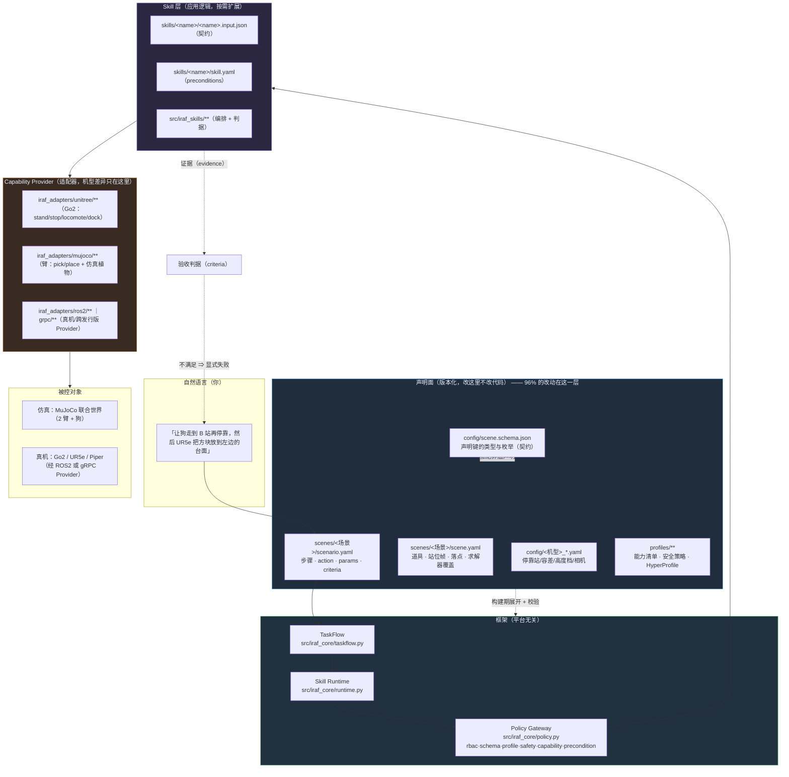
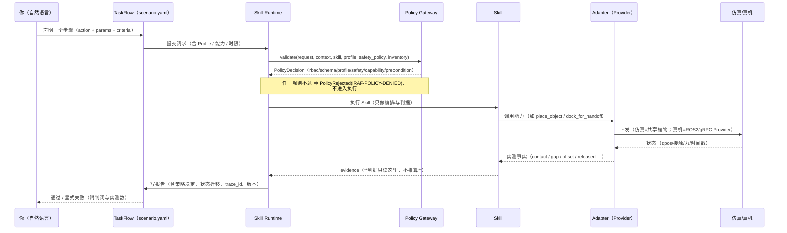
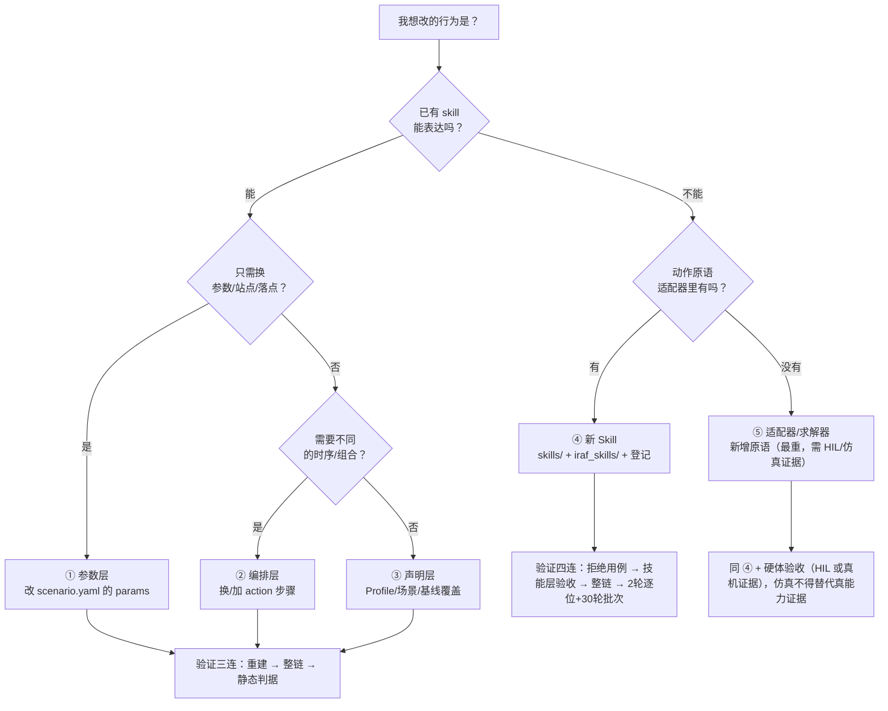

# 基于 Skill 的机器人应用开发说明（IRAF / AIIRAF）

> 适用版本：`main` ≥ `1edbd09`（2 臂 + Go2 联合演示整链 9/9，碰撞已修）
> 读者：机器人应用开发者、算法工程师、集成商、运维
> 一句话：**你只提供 TaskFlow（步骤）、Skill 参数与 Robot Profile；不需要了解 ROS topic、现场总线或板卡 SDK。**

---

## 0. 先记住四条硬边界（违反即为不合格）

| # | 边界 | 说明 |
|---|---|---|
| 1 | **不得旁路** | LLM/VLM/远程服务/业务应用**不得**直接下发电机、关节、力矩、现场总线或驱动命令；一切必须经 `TaskFlow → Skill Runtime → Policy Gateway → Capability Provider` |
| 2 | **判据不可放宽** | 验收判据只来自声明（`scenario.yaml` 的 `criteria` + Profile），实现层不得默认成功、不得截断 |
| 3 | **声明驱动** | 行为参数（站位、落点、接近方向、停靠容差、高度档…）都在声明里；实现层禁止写死机型差异 |
| 4 | **失败要显式** | 不可用/超时/越界 ⇒ 显式失败、安全停机、旁路人工接管；**禁止伪造成功**（例如"载荷其实没放下"不得报成功） |

---

## 1. 架构图（你写的东西落在哪一层）



**读完这张图只要记住一句**：**你改声明，框架执行，判据说话。** 只有当"能力不存在"或"声明表达不出来"时，才向下进到 Skill 层或适配器层。

---

## 2. 一次 Skill 调用的一生（时序图）



---

## 3. 「我想改 X」走哪一层？——决策流程（含条件场景）



### 3.1 条件场景对照表（照此判断，不用猜）

| 条件场景（你的原始诉求） | 走哪层 | 具体改哪里（键名） | 验证 | 常见坑 |
|---|---|---|---|---|
| "把方块放到**别的地方**" | ① | `scenario.yaml` step 的 `place_target_id`；落点本体在 `scene.yaml: props[<id>].geometry.pos_m` | 重建 + 整链 | 落点一动，**抓取名义目标**与 `home_rise_m` 可能需同改 |
| "让狗**站到别的点**" | ③ | `scene.yaml: frames[<站位帧>].pose.pos_m`（步骤按**站名**选站，不写坐标） | 重建 + 整链 + 净空探针 | 同事实多处：站位 ↔ 抓取目标字面量 ↔ 落点垫，**必须同改** |
| "停靠**更准一点 / 更慢**" | ③ | `config/<机型>_joint.yaml: dock_for_handoff.stations.<站>.{approach_position_tolerance_m, approach_yaw_tolerance_rad}`；`dock_for_handoff.timeout_s` | 单步整链 | 控制容差必须**严于**验收判据；换布局后"实测地板"会变，容差得跟着走 |
| "让狗**换个高度/趴在半高**交接" | ③→④ | 现有：`stand.height_target_m`（高度档，注意低档要保持精度需重标定）；若要"趴下"新动作 ⇒ ④ | 站立/技能层验收 | 低档偏差会变大（历史上 kp 下降曾致 46 mm 偏差） |
| "狗走**另一条路线**" | ② | `scenario.yaml` 里换/插 `action: locomote`（vx/vy/wz + duration_ms） | 整链 | 走廊不得穿越臂工作空间；联合世界里位置一致性由需求闸门保证 |
| "臂的**接近方向/姿态**换一下" | ③ | `reference_solver.baseline_overrides.grasp.{place_approach_direction, place_via, place_elbow_body, place_elbow_pref}` | 重建 + 静态判据 | 新键必须先登记 `scene.schema.json`；**同半球规则**会否掉不合方位的解 |
| "换一个**接收体**（托盘/垫/台面）" | ①③ | `place_target_id` + `place_targets` 的 `nominal_pose_m` | 重建 + 整链 | 联合报告里接收体顺序会影响 first-fit（必须声明 `place_target_id`） |
| "**新动作**：坐下 / 趴下 / 递给另一台臂" | ④ | `skills/<name>/` + `src/iraf_skills/` + 登记 | 拒绝用例 + 技能层 + 整链 | 登记**分散在十几处**，漏一处静默失效 |
| "换**机型**（新臂/新狗）" | ⑤ | `iraf_adapters/**` + `profiles/boards/**` + 能力表 | HIL/真机证据 | 禁止把 C++ `.so` 当跨平台插件 ABI；跨发行版 Provider 独立进程 + 版本化 gRPC/ROS2 |

---

## 4. 用自然语言对话开发的**协议**（照这个格式说，产物才可控）

### 4.1 你的需求要带全这 6 项（缺一项，助手只能猜，必须回问）
```
① 目标本体与场景   ：哪台臂/狗，哪个场景包（例：handoff_lab / nominal）
② 动作与顺序       ：做什么、在谁之后（例：狗停靠 B 站 → UR5e 取件 → 放到左侧台面）
③ 成功判据         ：可量化（例：落点偏移 ≤ 0.065 m；停靠偏航 ≤ 2.0°）
④ 失败与接管       ：允许重试几次、失败后停机还是人工接管
⑤ 时限/安全等级    ：单步时长上限、是否允许仿真降级
⑥ 当前证据         ：现状数字（例：现在 0.028 m / 2.45°）
```

### 4.2 助手的**固定产物**（每次都必须给，缺一即不合格）
```
1) 落层判定：属于 ①参数 / ②编排 / ③声明 / ④新Skill / ⑤适配器 哪一层，为什么
2) 声明 diff：逐行给出要改的文件与键（含"同一事实的其它处"清单）
3) 验证命令：重建 / 整链 / 判据（三条命令，可直接复制）
4) 证据口径：这次改动**依赖哪条实测**，旧值 vs 新值
5) 风险与拒绝路径：什么情况下会显式失败（不得静默降级）
6) 回滚法：一条命令回到上一状态（声明类 = 改回原值 + 重建）
```

### 4.3 示例对话（照抄可用）
```
你：场景 handoff_lab/nominal。我想让 UR5e 把方块放到**左侧**台面（现在放右侧）。判据不变（≤0.065 m）。
    失败按现有规则显式拒绝。时限沿用该 step 声明。现在落点偏移 0.0222 m。
助手（应给出的产物）：
  落层：③ 声明层（不改代码）
  diff：scene.yaml → props[place_pad_b].geometry.pos_m: [0.88,0.70,-0.005] → [<新值>]
        并检查同事实：reference_solver.target_override_world_m（抓取目标）是否需要同改；home_rise_m 是否仍可解
  验证：build_scene.py → scenario.py run --world joint → probe_place_carrier_dock_offset.py（净空）
  证据：当前落点 0.0222 m；净空 +0.111 m（改后必须复测）
  风险：若新位置导致 IK 不可解 ⇒ 构建期 fail-closed（不会静默变形）
  回滚：把 pos_m 改回并重建
```

---

## 5. 六个开发步骤（S0–S5，逐步可验收）

### S0 建工程 / 开工前检查
```bash
# 受控入口（仓库根）：先看现状，再动手
PYTHONPATH=src python3 scripts/scene_check.py --scene scenes/handoff_lab --require-model   # 声明与产物一致性
PYTHONPATH=src python3 scripts/scenario.py --help                                          # 可用入口
python3 - <<'PY'  # 现状证据（判据一个都不许动）
import json;d=json.load(open('build/acceptance/handoff_lab/nominal/report.json'))
print('passed=',d['passed']); [print(' ',s['id'],s['status'],s.get('measured')) for s in d['steps']]
PY
```

### S1 申报需求（自然语言 ⇒ 6 项模板，见 §4.1）
助手必须先回"落层判定"，**不得直接改代码**。

### S2 改声明（80% 的工作量在这里）
- 步骤/参数：`scenes/<场景>/scenario.yaml`
- 道具/站位/落点/求解器覆盖：`scenes/<场景>/scene.yaml`
- 机型行为参数：`config/<机型>_*.yaml`
- 新键先登记：`config/scene.schema.json`（类型 + 枚举 + 中文契约说明）
- **同事实清单**：站位帧 ↔ 抓取名义目标 ↔ 落点垫 ↔ 停靠容差（见 §3.1 与 §7）

### S3 受控重建 + 自检（构建期拦住一切几何/求解错误）
```bash
PYTHONPATH=src python3 scripts/build_scene.py --scene scenes/handoff_lab --robot unitree_go2 --attach piper --attach ur5e
PYTHONPATH=src python3 scripts/scene_check.py --scene scenes/handoff_lab --require-model
# 静态净空判据（秒级，改布局后必跑）：判据 = 臂↔载体 ≥ 0.030 m 且 臂↔台面/落点垫无侵入
PYTHONPATH=src python3 scripts/probe_place_carrier_dock_offset.py --margin 0.25 --carrier-z-mode explicit --carrier-z 0.276627
```

### S4 整链验收（判据说话）
```bash
PYTHONPATH=src python3 scripts/scenario.py run --scene scenes/handoff_lab --scenario nominal --world joint --display none
# 看报告：passed / 逐步骤 status / measured；失败必有判词（不得自行放宽）
```

### S5 可复现验收（**单轮通过不算验收**）
```bash
bash scripts/campaign_pass_rate.sh 30     # 通过率 + 每步 min/max（同值 = 逐位可复现）
# 演示录屏（需要给人看时）：用法见 scripts/record_demo.sh 头部注释（自带几何校验 + 帧差门禁 + 双份落盘）
```

---

## 6. 新增一个 Skill 的最小闭环（以"狗趴下"`lie_down` 为例）

```
① 契约      skills/lie_down/lie_down.input.json     （必填键、类型、范围；缺省值一律不写）
            skills/lie_down/skill.yaml              （capability / preconditions / 安全等级 / 版本）
② 实现      src/iraf_skills/lie_down.py             （编排 + 判据；物理实现落适配器）
            适配器新增原语：src/iraf_adapters/unitree/quadruped.py（如 posture(target_height, mode)）
③ 登记      profiles/**/capabilities ｜ 场景 allowed_skills ｜ 适配器 CAPABILITY_METHODS + IMPLEMENTED
            （**分散在十几处**：改完用 grep 复核，漏一处 = 静默失效）
④ 接线      scenes/handoff_lab/scenario.yaml 加 step：
              - id: s0x_lie_down
                action: lie_down
                robot: unitree_go2
                params: { target_height_m: 0.12, duration_ms: 6000 }
                criteria: { height_error_max_m: 0.030, final_speed_max_mps: 0.05 }
⑤ 拒绝路径  错误的高度档 / 缺 duration / 能力未声明 / 狗正在 locomote ⇒ 四条用例各一条
            （scripts/verify_quadruped_skills.py 有 minimum_rejection_cases 下限）
⑥ 验收      技能层验收 → 整链 → 判据不动 → 2 轮逐位 + 30 轮批次
```
**"趴下"的能力缺口提示（本次实测）**：低高度档的**保持精度**会退化（历史上 kp 降低导致偏差 ~46 mm），
所以新增 `lie_down` 时必须**同时给出该高度档的站立/姿态验收**，不能只做动作、不验精度。

---

## 7. 十条坑（本仓实测，照此避免返工）

1. **同一事实多处**：站位帧 / 抓取名义目标 / 落点垫 / 停靠容差 常各有一份 ⇒ 改一处必须列出其余处。
2. **能力登记分散**：`capabilities` 出现在十余个文件；漏一处 = 静默失效。
3. **名字口径**：求解/探针场景里 body 名**无前缀**（`forearm_link`）；联合模型里关节名**带前缀**（`ur5e_*`）。写错必须 fail-closed。
4. **成对声明要校验**：如 `place_elbow_body` 与 `place_elbow_pref` 必须同时给。
5. **新声明键先进 schema**：否则"合法但无契约"，错误值只在实现里才被拒。
6. **控制容差 ≠ 验收判据**：控制容差必须更严；换布局后"实测地板"会漂（本仓见过 0.0183 → 0.0206）。
7. **只读求解也会改状态**：`mj_forward` 会推动求解器暖启动 ⇒ "只读"的写法也可能改变结果（已在仓内修复，勿回退）。
8. **调试开关改变数值**：`IRAF_DEBUG_*` 会改墙钟与走向 ⇒ **判据必须走默认路径**；带开关的运行只能用于定位，不能当验收数。
9. **观测者效应**：逐拍打印/额外求解会改变被观测对象 ⇒ 探针要"内存累计 + 段末落盘"、要轻。
10. **仿真 ≠ 真能力**：仿真不得声明为真机能力；导航/停靠/传感器/交接必须分别验收，且必须声明 `simulation=true`。

---

## 8. 验收与提交纪律（团队约定）

```
判据      ：只来自声明；**不得**因"差一点"而放宽（本仓曾拒过多次"凑通过"）
可复现    ：同配置连跑 2 轮**逐位比对**；单轮通过不算验收；关键改动跑 30 轮批次
证据      ：成功路径与拒绝/失败路径都要有；否定结论也要留档（写在 docs/debug 或声明旁注释）
提交      ：Conventional Commits（中文）；契约 → 实现 → 文档 分批；架构/IDL/安全/板级变更另附证据
回滚      ：声明类改动 = 改回原值 + 重建；代码类改动先留可复跑探针再改
制品      ：不提交密钥、内部地址、模型权重、传感器原始数据、构建产物或日志
```

---

## 9. 你要的"图"怎么用

- 本文所有图都是 **Mermaid**：在 GitHub / VS Code（Markdown Preview Mermaid 插件）直接渲染；
- 导出 PNG/SVG：`mmdc -i docs/skill-app-development-guide.md -o docs/diagrams/skill-app.md`（需 `@mermaid-js/mermaid-cli`），
  或直接把 Mermaid 代码块粘到 https://mermaid.live 导出；
- 终端里快速看结构：见附录 A 的 ASCII 版。

---

## 附录 A：终端可读的架构图（ASCII）

```
        你（自然语言）
             │  ①参数 ②编排 ③声明 → 全是"声明"，版本化可 diff
             ▼
 ┌────────────────── 声明面（96% 的改动） ──────────────────┐
 │ scenes/<场景>/scenario.yaml   步骤·action·params·criteria │
 │ scenes/<场景>/scene.yaml      道具·站位帧·落点·求解器覆盖   │
 │ config/<机型>_*.yaml          停靠站/容差/高度档/相机       │
 │ profiles/**                   能力清单·安全策略·HyperProfile│
 │ config/scene.schema.json      声明键类型与枚举（契约）       │
 └───────────────────────────┬──────────────────────────────┘
                             ▼ 构建期展开 + 校验（fail-closed）
 ┌──────────── 框架（平台无关）────────────┐
 │ TaskFlow → Skill Runtime → Policy Gateway │
 │ (taskflow.py)  (runtime.py)   (policy.py) │
 └───────────────┬──────────────────────────┘
                 ▼
 ┌──────────── Skill 层（应用逻辑）────────────┐
 │ skills/<name>/{<name>.input.json, skill.yaml} │
 │ src/iraf_skills/**（编排 + 判据，只读 evidence）│
 └───────────────┬─────────────────────────────┘
                 ▼
 ┌──────── Capability Provider（机型差异只在这里）────────┐
 │ iraf_adapters/unitree/**（狗）｜mujoco/**（臂·仿真）      │
 │ ros2/** ｜ grpc/**（真机 / 跨发行版独立进程）             │
 └───────────────┬────────────────────────────────────────┘
                 ▼
        仿真（MuJoCo 联合世界） ／ 真机（Go2 · UR5e · Piper）
                 │
                 └──► evidence ──► criteria（不满足 ⇒ 显式失败，绝不伪造成功）
```

## 附录 B：三个可直接照抄的最小示例

**例 1（① 参数层）——换放置接收体**
```yaml
# scenes/handoff_lab/scenario.yaml
- id: s07_place_at_b_table
  action: place_object
  robot: ur5e
  params: { place_target_id: place_pad_b, payload_id: box_01, duration_ms: 8000 }   # ← 只改 place_target_id
  criteria: { require_release: true, require_payload_in_tray: true, max_offset_from_tray_center_m: 0.065 }
```

**例 2（③ 声明层）——把狗站位移出机械臂腕部走廊**（本仓真实修复）
```yaml
# scenes/handoff_lab/scene.yaml
- id: handoff_station_frame_b
  kind: site
  pose: { pos_m: [0.15, 0.45, 0.0] }      # 原 [0.45,0.45,0]；配合抓取目标字面量与 home_rise_m 同改
```
验证：`build_scene.py` → `probe_place_carrier_dock_offset.py`（净空 −0.0568 → +0.1111 m）→ `scenario.py run`（9/9）

**例 3（④ 新 Skill）——骨架文件清单**
```
skills/lie_down/lie_down.input.json      # {target_height_m: number(0.06..0.30, 必填), duration_ms: int(1..30000)}
skills/lie_down/skill.yaml               # capability: lie_down；preconditions: 狗已 stand 且未在 locomote
src/iraf_skills/lie_down.py              # 调适配器 posture(target_height, mode="lie")，判 height_error/final_speed
src/iraf_adapters/unitree/quadruped.py   # 新增 posture() 原语（若不存在）
profiles/**.yaml + 场景 allowed_skills   # 登记能力（复核全部登记点）
scenes/handoff_lab/scenario.yaml          # 加 step（含 criteria）
scripts/verify_quadruped_skills.py       # 补 4 条拒绝用例
```
```
